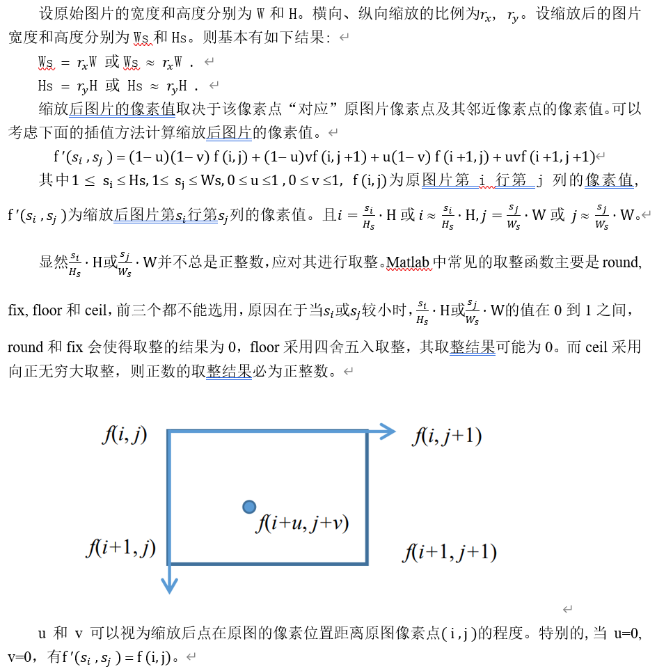
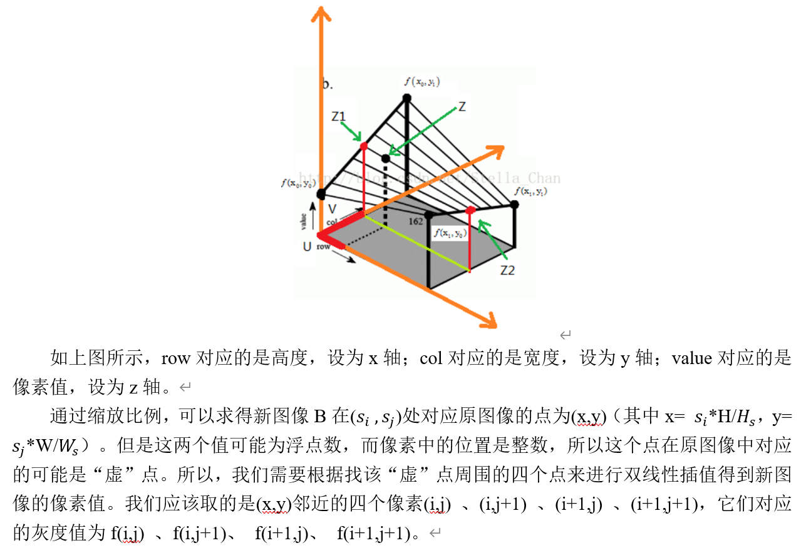
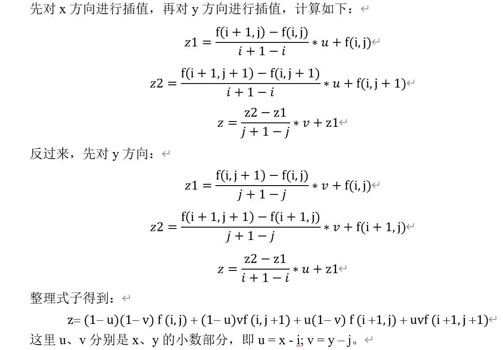

# 图像缩放实验

设计缩放函数对图片文件进行缩放实验。

## 设计思路	

## 运行结果	

### 基本任务	

### 自行选择图片进行实验

## 实验自评与改进方向

### 插值法的理解与 u、v 的量化

### 性能比较	

Matlab的官方工具库本身也有对图片进行缩放与旋转的函数：

imresize(image,m,method)函数可以进行对图片的缩放：

image为需要进行处理的图片；m为缩放的倍数（m>1时放大,m<1时缩小）；method用于指定插值的方法，可选值为“nearest”（默认）最近邻插值、“bilinear”双线性插值、“bicubic”双三次插值。

相比于imresize函数，本实验方法所用的函数运行速度明显较慢。主要原因在于for循环在matlab中效率低下，双重for循环效率就更差了。而imresize是matlab中用C等其他语言写成的内建函数（built-in functions），效率自然很高。

提高运行速度的一个简单方法是不使用for循环，所有相关的操作以矩阵或向量运算的方式实现。关键步骤是由缩放图片的行索引si和列索引sj求出其对应点在原图的行索引x和列索引y，接着由meshgrid函数基于向量x和y中包含的坐标返回二维网格坐标X和Y。两个矩阵的整数部分为对应点的邻近点在原图的索引I和J，小数部分为插值的参数U和V。同样，I和J要进行边界处理。

## 实验总结与体会	

